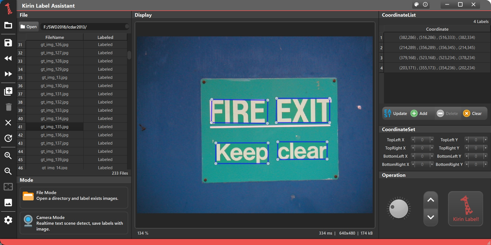
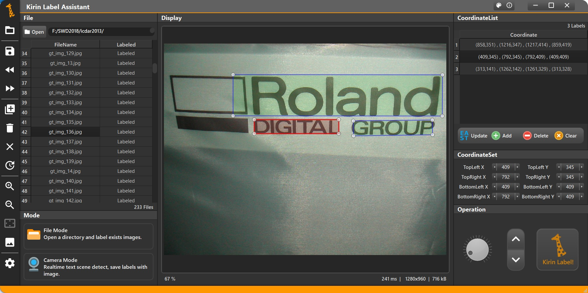

**Scene-Text Label Assistant** is a **Cross-Platform** desktop computer program with user friendly GUI interface, which helps to create training set for **Scene Text Detection**. Users can use the program to label their own images efficiently with the help of the automatic label function, which utilized [EAST neural network](https://arxiv.org/abs/1704.03155v2) to generate labels automatically. Users only need to correct few model's wrong label results.

It is programmed in C++ with [Qt](https://www.qt.io/) framework. The EAST model applied in the program by using [OpenCV](https://opencv.org/) Library.

Here are some of the examples using the software:

